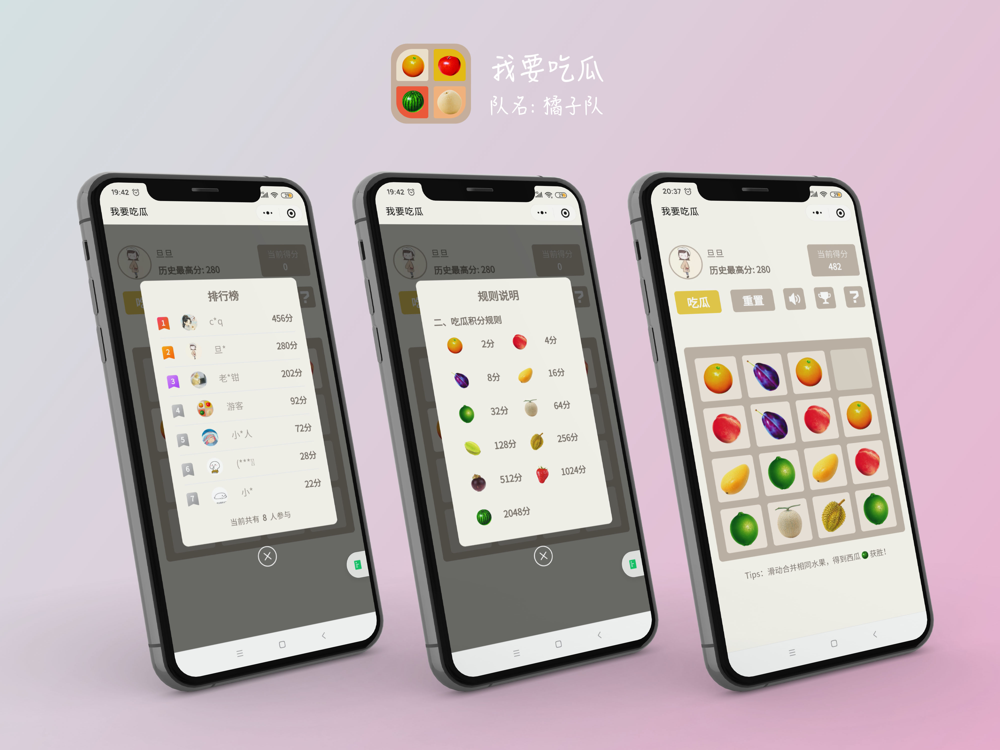
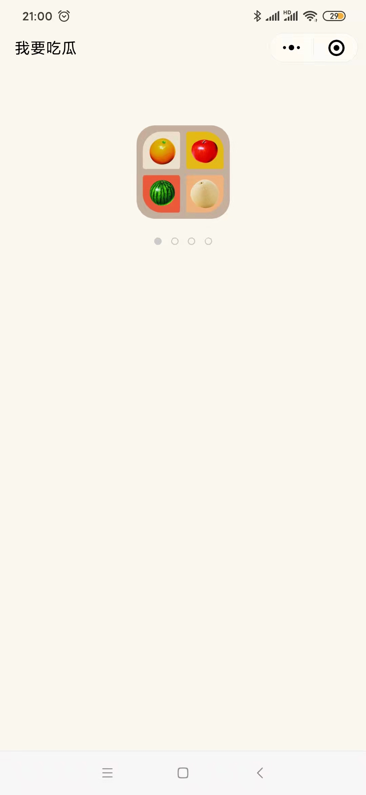
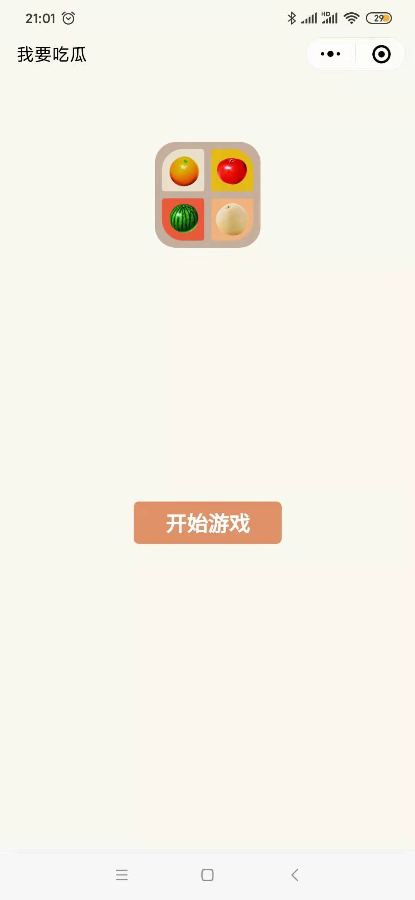
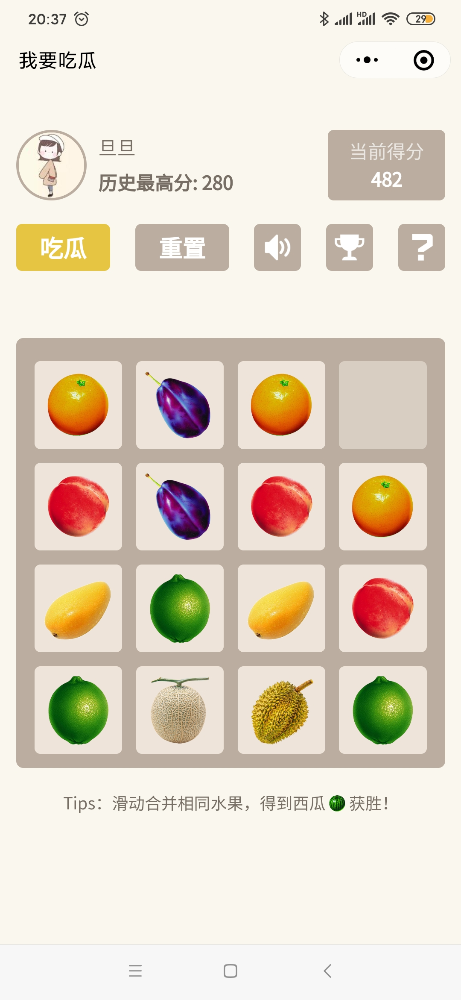
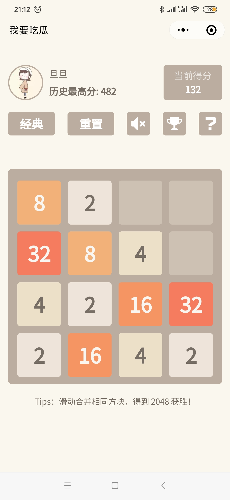
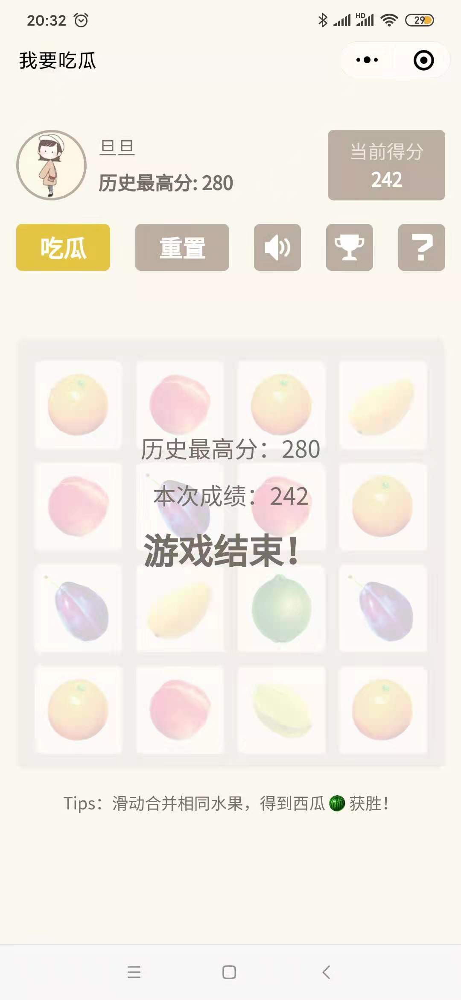
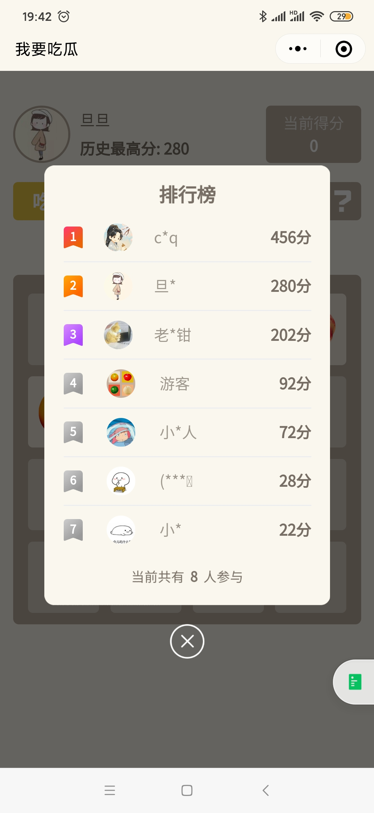
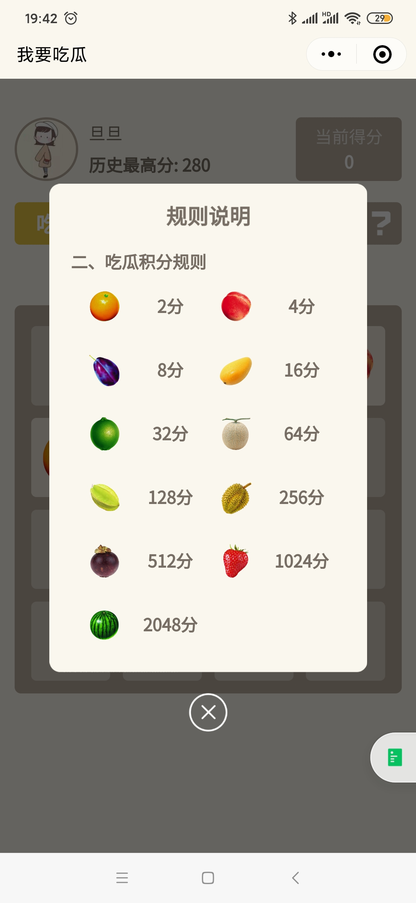

## 云开发应用-我要吃瓜-橘子队

### 团队/作者简介
* 队伍名称：橘子队

### 作品简介
该作品是一个休闲小游戏，基于经典的2048游戏和近期很火的合成大西瓜，设计了此吃瓜版2048小游戏。游戏可以自由切换吃瓜/经典两种模式。
吃瓜版游戏规则：合并两个相同的水果生成新的水果，最后得到西瓜🍉则挑战成功！
主要功能：游戏模式切换 、分数统计、排行榜、音效开关、游戏规则等

### 封面图（尺寸为800*600px）
 

### 云开发能力应用情况
* 云函数（用户新增、用户信息查询、用户最高分更新、排行榜查询）
* 云数据库（用户信息表： 头像、昵称、最高分等）
* 云存储（游戏音效、图片等）

### 功能模块介绍（内容叙述形式不限，建议图文并茂，越完整分数越高哦）
#### 1、loading页面/启动页面
 

#### 2、游戏页面（吃瓜模式/经典模式）
 

#### 3、游戏结果

#### 4、排行榜

#### 5、规则

#### 体验二维码
* 小程序名称：为之则难者亦易（已发布）
* 

### 源码链接
https://github.com/WeDaHub/App-CloudBase-Melon

